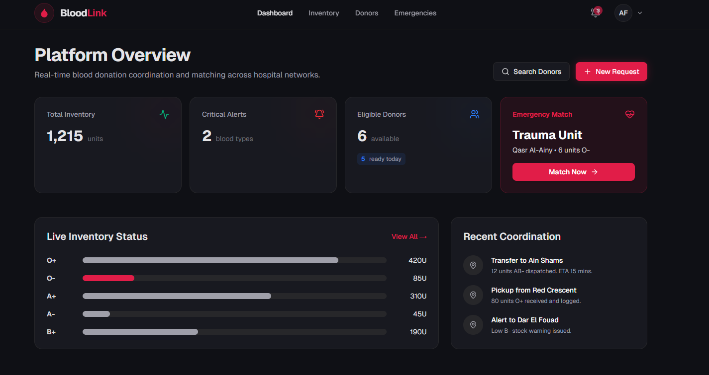
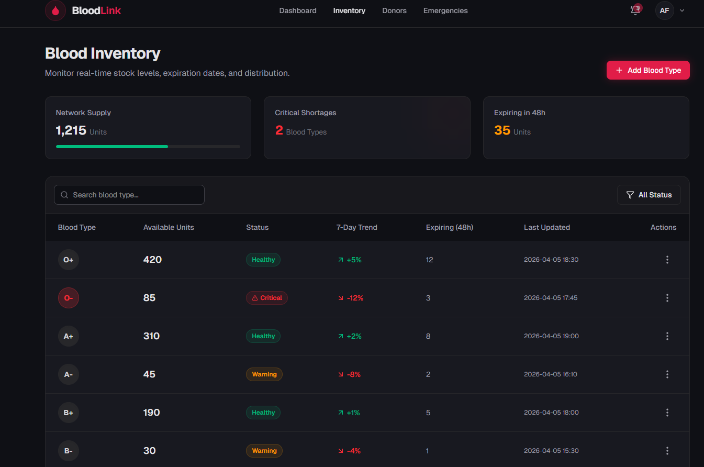
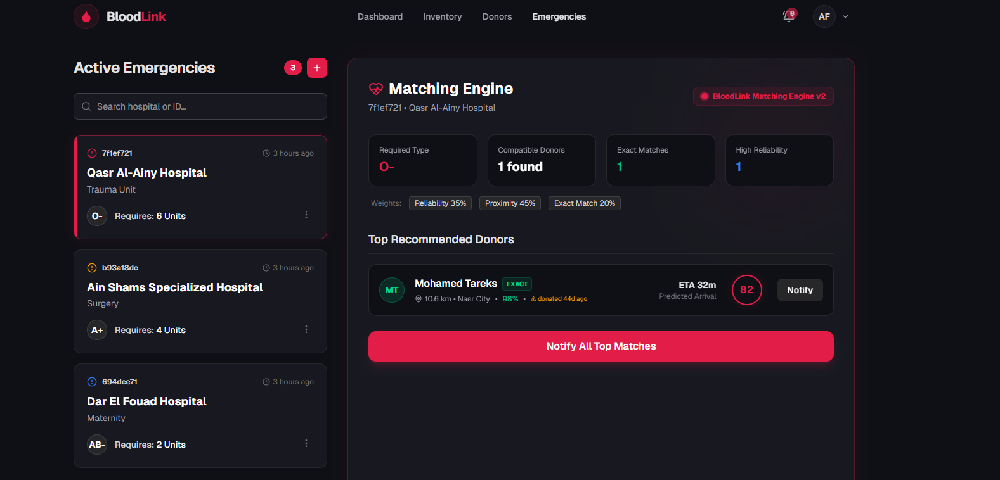
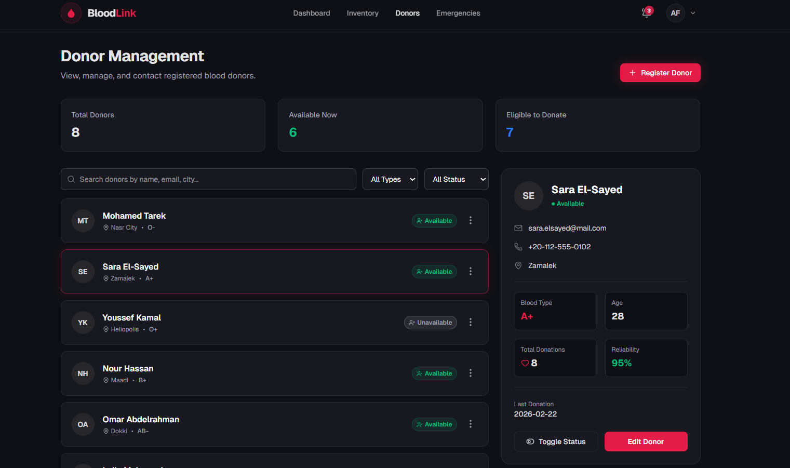
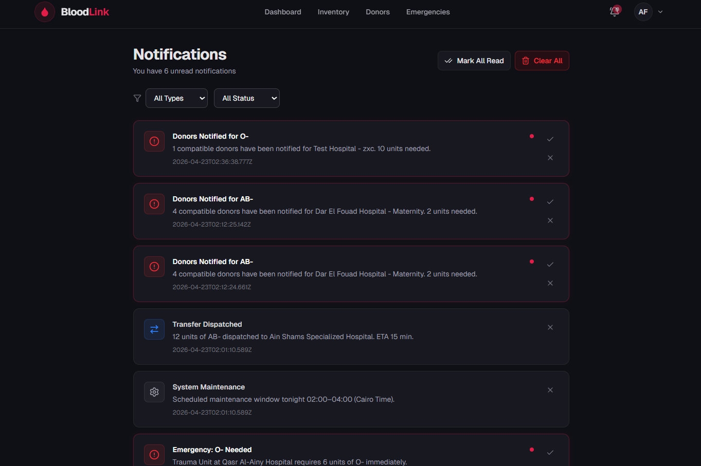
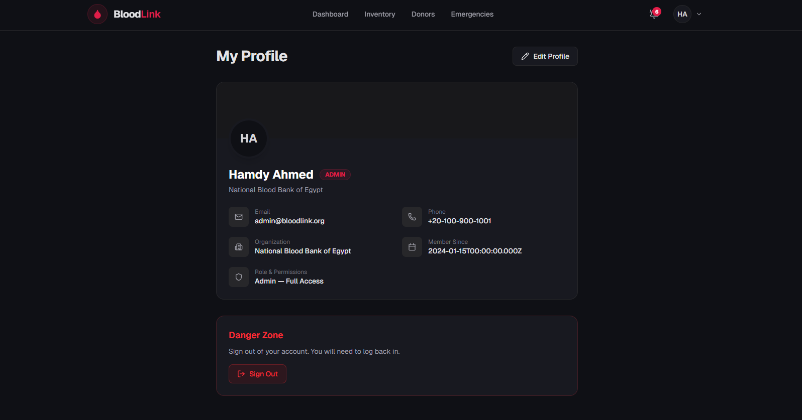
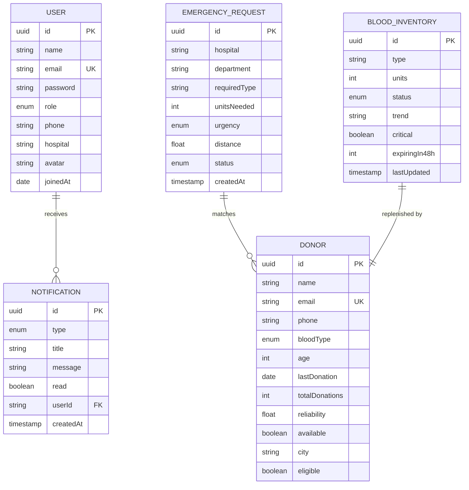
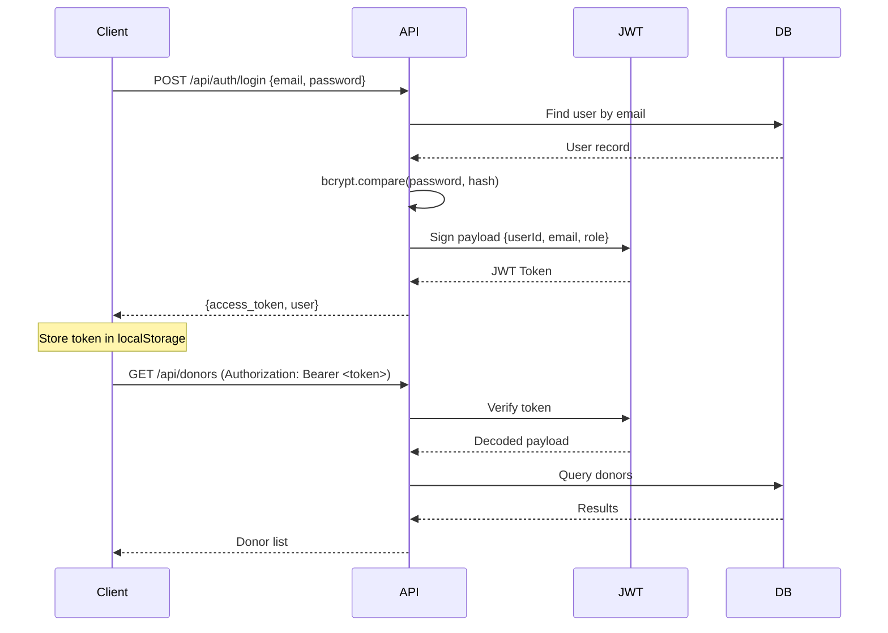

<p align="center">
  
  
  
  
  
</p>

<h1 align="center">🩸 BloodLink</h1>

<p align="center">
  <b>Real-time Blood Bank Management &amp; Intelligent Donor Matching System</b><br>
  A full-stack clinical platform for managing blood inventory, donor networks, emergency requests, and automated donor-to-patient matching using a multi-factor scoring algorithm.
</p>

<p align="center">
  <a href="#-getting-started">Getting Started</a> •
  <a href="#-features">Features</a> •
  <a href="#-matching-engine-v2">Matching Engine</a> •
  <a href="#-tech-stack">Tech Stack</a> •
  <a href="#-api-reference">API Reference</a> •
  <a href="#-project-structure">Project Structure</a>
</p>

---

## 🚀 Getting Started

### Prerequisites

- **Node.js** ≥ 18
- **npm** ≥ 9
- **PostgreSQL** 14+ (remote or local)

### 1. Clone the Repository

```bash
git clone https://github.com/hamdy-fathi/BloodLink.git
cd BloodLink
```

### 2. Backend Setup

```bash
cd backend
npm install
```

Create a `.env` file in `backend/`:

```env
PORT=3001
DB_HOST=your_db_host
DB_PORT=5432
DB_USERNAME=your_db_user
DB_PASSWORD="your_db_password"
DB_NAME=BloodLink
JWT_SECRET=your_jwt_secret_key
```

Start the backend:

```bash
npm run start:dev
```

The backend will:
- Connect to PostgreSQL
- Auto-synchronize database schema via TypeORM
- Seed the database on first run with sample data
- Start listening on `http://localhost:3001/api`

### 3. Frontend Setup

```bash
cd frontend
npm install
npm run dev
```

The frontend starts on `http://localhost:3000`.

### 4. Default Login Credentials

| Role | Email | Password |
|---|---|---|
| 🔴 Admin | `admin@bloodlink.org` | `admin123` |
| 🟢 Staff | `staff@qasr.org` | `staff123` |
| 🔵 Manager | `manager@dar-elfouad.org` | `manager123` |

---

## 📸 Screenshots

> 

| Dashboard | Blood Inventory |
|---|---|
|  |  |

| Emergency Matching Engine | Donor Management |
|---|---|
|  |  |

| Notifications | Profile |
|---|---|
|  |  |

---

## ✨ Features

### 🏥 Blood Inventory Management
- Real-time tracking of all 8 blood types (O±, A±, B±, AB±)
- Auto-calculated status thresholds: **Healthy** (≥100), **Warning** (20–99), **Critical** (<20)
- 7-day trend indicators with directional arrows
- Expiring-in-48h tracking per blood type
- Full CRUD: Add, Edit, Delete blood units

### 👥 Donor Management
- Complete donor registry with filtering by blood type, availability, and search
- Donor detail panel with reliability scoring, donation history, and contact info
- One-click availability toggle (Available / Unavailable)
- Eligibility tracking to prevent unsafe donations

### 🚨 Emergency Request System
- Create, edit, and delete emergency blood requests
- Per-request urgency levels: **Critical**, **High**, **Medium**, **Low**
- Hospital and department tracking
- Integrated with the Matching Engine for immediate donor search

### 🧠 Intelligent Matching Engine v2
- Multi-factor scoring algorithm for optimal donor-patient pairing
- Haversine-based geospatial distance calculation
- Urgency-adaptive weight profiles
- Exact blood type match prioritization
- Donor recency safety penalty (8-week cooldown)
- *(See [Matching Engine v2](#-matching-engine-v2) section for full details)*

### 🔔 Notification System
- 5 notification categories: Emergency, Shortage, Donation, Transfer, System
- Individual mark-as-read, dismiss, and bulk actions
- Real-time unread count badge in navigation
- Toast notifications for all CRUD operations across the app

### 👤 User Authentication & Profiles
- JWT-based authentication with bcrypt password hashing
- Role-based access: **Admin**, **Staff**, **Manager**
- Editable user profiles with hospital assignment
- Persistent login via localStorage token

### 🎨 UI/UX
- Dark-themed medical dashboard with premium glassmorphism design
- Toast notification system (success, error, info) replacing all `alert()` calls
- Responsive layout for desktop and tablet
- Lucide React icon library
- Smooth transitions and micro-animations

---

## 🧠 Matching Engine v2

The core of BloodLink is its **multi-factor donor matching algorithm** that scores and ranks compatible donors for each emergency blood request.

### Formula

```
Score = (Reliability × Wr) + (Proximity × Wp) + (ExactMatch × We) - RecencyPenalty
```

Where `Wr`, `Wp`, and `We` are urgency-adaptive weights.

### Scoring Factors

| Factor | Range | Description |
|---|---|---|
| **Reliability** | 0–100 | Donor's historical reliability score based on past donations |
| **Proximity** | 0–100 | Haversine distance-based score: `max(0, 100 - distanceKm × 2.5)` |
| **Exact Match** | 0 or 100 | Binary bonus if donor blood type matches exactly (not just compatible) |
| **Recency Penalty** | 0–25 | Penalty for donors who donated within the last 56 days (8-week safety window) |

### Urgency-Adaptive Weight Profiles

| Urgency Level | Reliability (Wr) | Proximity (Wp) | Exact Match (We) | Strategy |
|---|---|---|---|---|
| 🔴 **Critical** | 35% | 45% | 20% | Speed-first — closest reliable donors |
| 🟠 **High** | 45% | 35% | 20% | Balanced — reliability slightly preferred |
| 🟡 **Medium** | 55% | 25% | 20% | Reliability-heavy — best donor quality |
| 🟢 **Low** | 60% | 20% | 20% | Quality-first — distance is less critical |

### Distance Calculation

Distances are calculated using the **Haversine formula** between mapped Cairo district coordinates:

```
d = 2R × arcsin(√(sin²(Δlat/2) + cos(lat₁) × cos(lat₂) × sin²(Δlng/2)))
```

**15 Cairo districts** are mapped with real GPS coordinates:

| District | Latitude | Longitude |
|---|---|---|
| Nasr City | 30.0511 | 31.3456 |
| Zamalek | 30.0608 | 31.2194 |
| Heliopolis | 30.0866 | 31.3225 |
| Maadi | 29.9602 | 31.2569 |
| Dokki | 30.0382 | 31.2049 |
| 6th of October City | 29.9723 | 30.9446 |
| Mohandessin | 30.0545 | 31.2003 |
| New Cairo | 30.0098 | 31.4913 |
| Downtown | 30.0444 | 31.2357 |
| Giza | 30.0131 | 31.2089 |
| Shubra | 30.1073 | 31.2497 |
| Ain Shams | 30.1310 | 31.3279 |
| El Marg | 30.1640 | 31.3540 |
| El Matariya | 30.1231 | 31.3130 |
| El Manial | 30.0100 | 31.2270 |

### Blood Compatibility Matrix

The system uses medically accurate ABO/Rh compatibility rules:

| Recipient | Can Receive From |
|---|---|
| O+ | O+, O- |
| O- | O- |
| A+ | A+, A-, O+, O- |
| A- | A-, O- |
| B+ | B+, B-, O+, O- |
| B- | B-, O- |
| AB+ | All types (universal recipient) |
| AB- | A-, B-, AB-, O- |

### Recency Safety Window

Donors who donated within the **last 56 days** (8 weeks, per WHO guidelines) receive a proportional penalty:

```
penalty = 25 × (1 - daysSinceLastDonation / 56)
```

- Donated **today** → -25 penalty
- Donated **28 days ago** → -12.5 penalty
- Donated **56+ days ago** → No penalty

### Tie-Breaking

When multiple donors have the same composite score:
1. **Exact match** donors are ranked first
2. **Closer donors** (lower distance) are ranked second

---

## 🛠 Tech Stack

### Backend
| Technology | Version | Purpose |
|---|---|---|
| **NestJS** | 11.x | Server framework with modular architecture |
| **TypeORM** | 0.3.x | ORM for PostgreSQL with entity decorators |
| **PostgreSQL** | 17 | Production relational database |
| **Passport + JWT** | — | Authentication strategy |
| **bcrypt** | 6.x | Password hashing |
| **class-validator** | 0.15 | DTO validation with decorators |
| **class-transformer** | 0.5 | Payload transformation |

### Frontend
| Technology | Version | Purpose |
|---|---|---|
| **Next.js** | 16.2 | React framework with App Router |
| **React** | 19.2 | UI library |
| **TypeScript** | 5.x | Type safety |
| **Tailwind CSS** | 4.x | Utility-first styling |
| **Axios** | 1.15 | HTTP client with JWT interceptor |
| **Lucide React** | 1.7 | Icon library |

---

## 📡 API Reference

All endpoints are prefixed with `/api` and require JWT authentication (except login).

### Auth

| Method | Endpoint | Description |
|---|---|---|
| `POST` | `/api/auth/login` | Login with email/password → returns JWT |
| `GET` | `/api/auth/me` | Get current authenticated user |

### Users

| Method | Endpoint | Description |
|---|---|---|
| `GET` | `/api/users/:id` | Get user by ID |
| `PATCH` | `/api/users/:id` | Update user profile |

### Donors

| Method | Endpoint | Description |
|---|---|---|
| `GET` | `/api/donors` | List all donors (supports `?search=`, `?bloodType=`, `?available=`) |
| `GET` | `/api/donors/:id` | Get donor by ID |
| `POST` | `/api/donors` | Register a new donor |
| `PATCH` | `/api/donors/:id` | Update donor information |
| `PATCH` | `/api/donors/:id/toggle-availability` | Toggle donor availability |
| `DELETE` | `/api/donors/:id` | Remove a donor |

### Inventory

| Method | Endpoint | Description |
|---|---|---|
| `GET` | `/api/inventory` | List all blood inventory items |
| `GET` | `/api/inventory/:id` | Get inventory item by ID |
| `POST` | `/api/inventory` | Add blood units |
| `PATCH` | `/api/inventory/:id` | Update inventory item |
| `DELETE` | `/api/inventory/:id` | Remove inventory item |

### Emergencies

| Method | Endpoint | Description |
|---|---|---|
| `GET` | `/api/emergencies` | List all active emergencies |
| `GET` | `/api/emergencies/:id` | Get emergency by ID |
| `POST` | `/api/emergencies` | Create new emergency request |
| `PATCH` | `/api/emergencies/:id` | Update emergency request |
| `DELETE` | `/api/emergencies/:id` | Delete emergency request |
| `GET` | `/api/emergencies/:id/match` | Run matching engine for this emergency |
| `POST` | `/api/emergencies/:id/notify` | Notify matched donors |
| `PATCH` | `/api/emergencies/:id/resolve` | Mark emergency as resolved |

### Notifications

| Method | Endpoint | Description |
|---|---|---|
| `GET` | `/api/notifications` | List all notifications for current user |
| `PATCH` | `/api/notifications/:id/read` | Mark notification as read |
| `PATCH` | `/api/notifications/read-all` | Mark all as read |
| `DELETE` | `/api/notifications/:id` | Dismiss notification |
| `DELETE` | `/api/notifications/clear-all` | Clear all notifications |

---

## 📁 Project Structure

```
BloodLink/
├── backend/                          # NestJS API Server
│   ├── src/
│   │   ├── auth/                     # JWT authentication module
│   │   │   ├── auth.controller.ts
│   │   │   ├── auth.service.ts
│   │   │   └── jwt.strategy.ts
│   │   ├── donors/                   # Donor management module
│   │   │   ├── donors.controller.ts
│   │   │   ├── donors.service.ts
│   │   │   └── dto/
│   │   │       ├── create-donor.dto.ts
│   │   │       └── update-donor.dto.ts
│   │   ├── emergencies/              # Emergency requests + Matching Engine
│   │   │   ├── emergencies.controller.ts
│   │   │   ├── emergencies.service.ts    # ← Contains Matching Engine v2
│   │   │   └── dto/
│   │   │       ├── create-emergency.dto.ts
│   │   │       └── update-emergency.dto.ts
│   │   ├── entities/                 # TypeORM entity definitions
│   │   │   ├── user.entity.ts
│   │   │   ├── donor.entity.ts
│   │   │   ├── blood-inventory.entity.ts
│   │   │   ├── emergency-request.entity.ts
│   │   │   └── notification.entity.ts
│   │   ├── inventory/                # Blood inventory module
│   │   │   ├── inventory.controller.ts
│   │   │   ├── inventory.service.ts
│   │   │   └── dto/
│   │   ├── notifications/            # Notification module
│   │   │   ├── notifications.controller.ts
│   │   │   ├── notifications.service.ts
│   │   │   └── dto/
│   │   ├── seed/                     # Database seeder (runs on first launch)
│   │   │   └── seed.service.ts
│   │   ├── users/                    # User profile module
│   │   ├── app.module.ts             # Root module with TypeORM config
│   │   └── main.ts                   # Entry point (port, CORS, validation)
│   ├── .env                          # Environment variables
│   └── package.json
│
├── frontend/                         # Next.js 16 App
│   ├── src/
│   │   ├── app/
│   │   │   ├── page.tsx              # Dashboard (main landing page)
│   │   │   ├── login/page.tsx        # Authentication page
│   │   │   ├── inventory/page.tsx    # Blood inventory management
│   │   │   ├── donors/page.tsx       # Donor registry
│   │   │   ├── emergencies/page.tsx  # Emergency requests + Matching Engine UI
│   │   │   ├── notifications/page.tsx# Notification center
│   │   │   ├── profile/page.tsx      # User profile
│   │   │   ├── layout.tsx            # Root layout with providers
│   │   │   ├── providers.tsx         # Context + Toast providers
│   │   │   └── globals.css           # Global styles + animations
│   │   ├── components/
│   │   │   ├── Navbar.tsx            # Navigation bar with unread badge
│   │   │   └── Toast.tsx             # Toast notification system
│   │   └── lib/
│   │       ├── api.ts                # Axios client with JWT interceptor
│   │       ├── context.tsx           # Global app state (React Context)
│   │       └── types.ts              # TypeScript type definitions
│   └── package.json
│
├── screenshots/                      # UI screenshots (placeholder)
├── class_diagram.md                  # UML class diagram documentation
├── sequence_diagrams.md              # Sequence diagram documentation
└── README.md                         # ← You are here
```

---

## 🗄 Database Schema

### Entity Relationship



---

## 🌱 Seed Data

On first launch, the database is automatically populated with:

| Entity | Count | Details |
|---|---|---|
| **Users** | 3 | Admin, Staff, Manager with hashed passwords |
| **Donors** | 8 | Across 8 Cairo districts, all blood types |
| **Inventory** | 8 | One per blood type with varied statuses |
| **Notifications** | 7 | Mixed types, some read/unread |
| **Emergencies** | 3 | Critical, High, Medium urgency levels |

---

## 🔐 Authentication Flow



---

## 🔀 Branching Strategy

Each feature is developed on a separate branch:

| Branch | Description |
|---|---|
| `main` | Stable production branch |
| `feature/backend-full-implementation` | NestJS + PostgreSQL backend migration |
| `feature/frontend-api-integration` | Frontend mock data → real API integration |
| `feature/toast-notification-system` | Toast notifications replacing alerts |
| `feature/emergency-crud-operations` | Edit/delete for emergency requests |
| `feature/enhanced-matching-engine-v2` | Multi-factor matching algorithm |

---

## 📋 Environment Variables

| Variable | Description | Example |
|---|---|---|
| `PORT` | Backend server port | `3001` |
| `DB_HOST` | PostgreSQL host address | `localhost` |
| `DB_PORT` | PostgreSQL port | `5432` |
| `DB_USERNAME` | Database username | `BloodLink_user` |
| `DB_PASSWORD` | Database password | `*******` |
| `DB_NAME` | Database name | `BloodLink` |
| `JWT_SECRET` | Secret key for JWT signing | `*******` |

---

## 📄 License

This project is developed as part of a Biomedical Engineering academic project.


---

