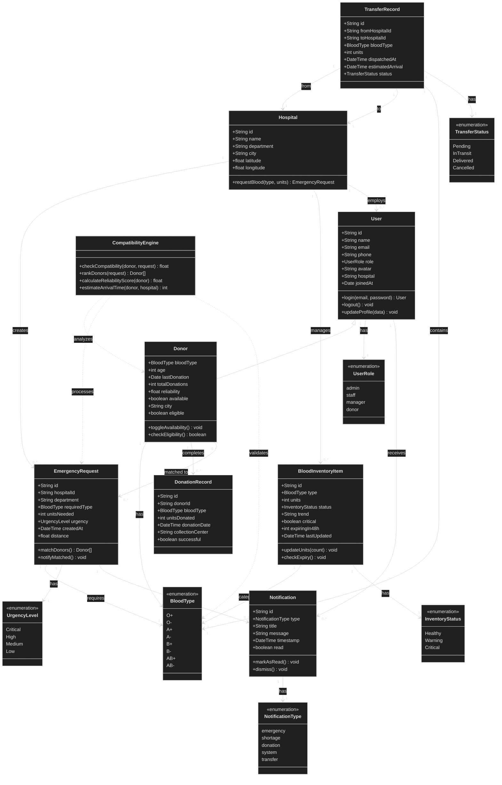

# BloodLink — Core Domain Class Diagram

## Visual Export (Dark Theme)

> [!NOTE]
> The diagram has been exported with white lines on a dark background to match the project's aesthetic.

## Mermaid Class Diagram

## Entity Summary

| Entity | Description |
|---|---|
| **User** | System operator (admin, staff, manager, donor role) |
| **Donor** | Registered blood donor with eligibility & availability tracking |
| **BloodInventoryItem** | Blood stock per type with status, trends, and expiry alerts |
| **EmergencyRequest** | Hospital blood request with urgency and donor matching |
| **Hospital** | Medical facility creating requests and managing inventory |
| **Notification** | System alert (emergency, shortage, donation, transfer, system) |
| **DonationRecord** | Historical log of each completed donation |
| **TransferRecord** | Inter-hospital blood transfer with dispatch and delivery tracking |
| **CompatibilityEngine** | Service class for donor-request matching and ranking |

## Key Relationships

- A **Hospital** manages multiple **BloodInventoryItems** and creates **EmergencyRequests**
- An **EmergencyRequest** triggers **Notifications** and is matched to compatible **Donors**
- A **Donor** has a **BloodType** and accumulates **DonationRecords** over time
- **TransferRecords** track blood shipments between two **Hospitals**
- The **CompatibilityEngine** ranks **Donors** against **EmergencyRequests** using blood type compatibility, reliability, and proximity

## Architecture Review Notes

1.  **Inheritance Strategy**: `User <|-- Donor` is implemented to ensure Donors can take advantage of all User-level features (Authentication, Profile Management, Notifications) without duplicating core identity fields (Name, Email, Phone).
2.  **Normalization**: The `Donor` entity now only stores medical and donor-specific transactional data (Blood Type, Reliability, Donation History).
3.  **Notification Pipeline**: `Notification` is linked to the base `User` class, allowing both Staff and Donors to receive system alerts through the same channel.
4.  **Mock Alignment**: The model is 1:1 with the current React Context and TypeScript types, ensuring a smooth transition to the NestJS/MongoDB backend.
