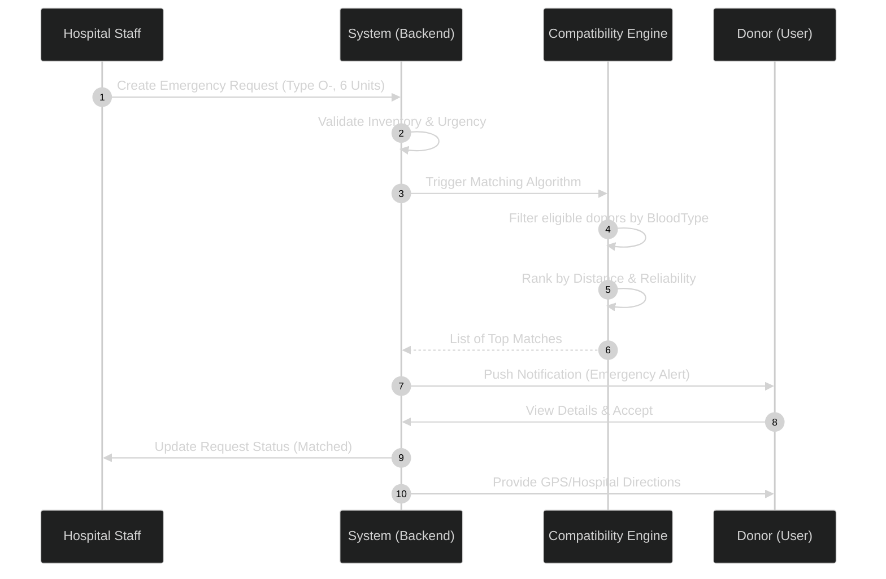
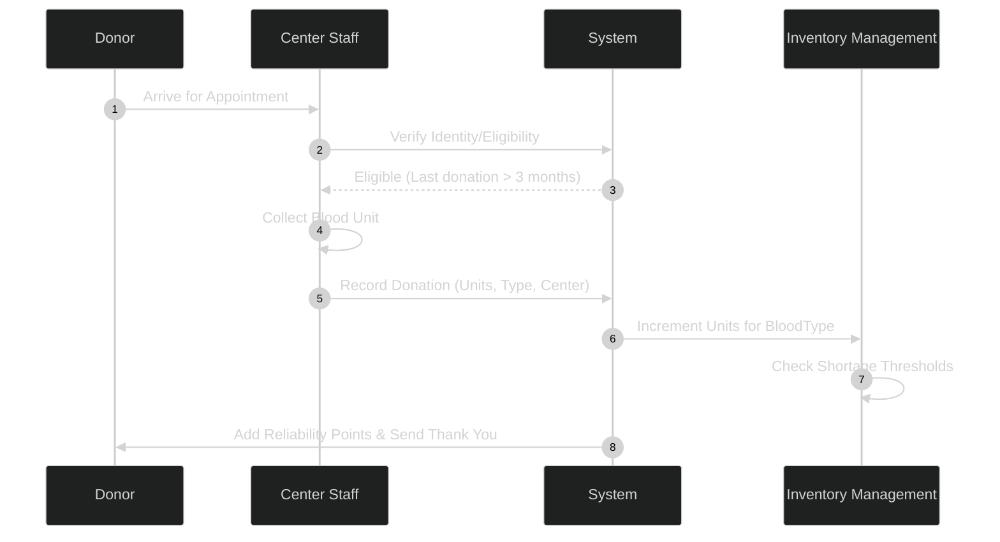
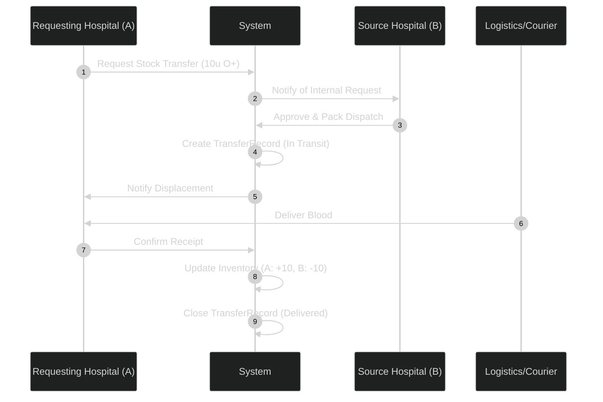

# BloodLink — Core Sequence Diagrams

This document outlines the primary operational workflows of the BloodLink platform.

## 1. Emergency Matching & Notification Flow
This flow tracks the process from a hospital emergency request to donor notification.

> [!NOTE]
> This diagram illustrates the real-time coordination between hospitals and the donor network.

## 2. Donation & Inventory Update
Records a successful blood donation and updates the global inventory.

## 3. Inter-Hospital Blood Transfer
Handles the logistics of moving stock between facilities.

## Review Summary

- **Auth Integration**: Since `Donor` inherits from `User`, the push notifications and "View Details" actions directly hit the shared Notification/User modules.
- **Latency Control**: The `CompatibilityEngine` decoupling allows for asynchronous processing during high-volume emergencies.
- **Audit Trail**: Every flow generates a record (EmergencyRecord, DonationRecord, TransferRecord) for accountability.
